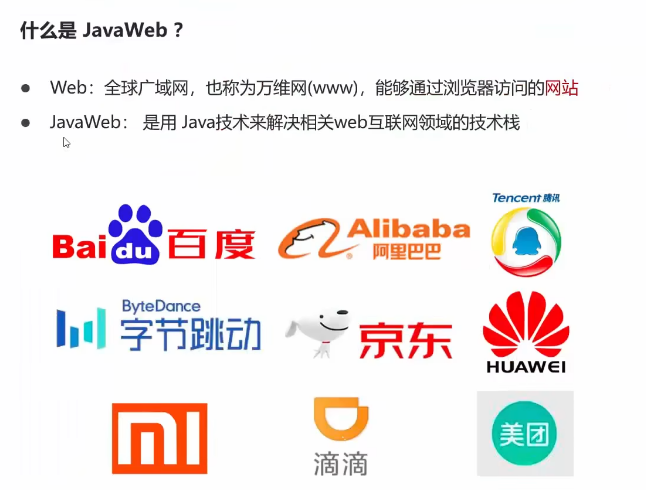
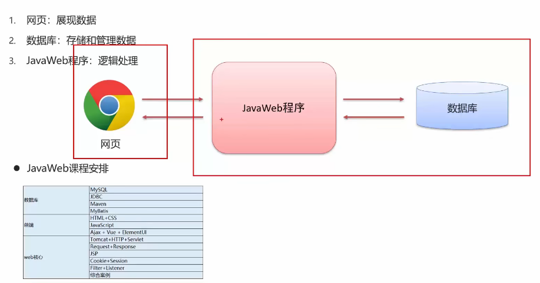
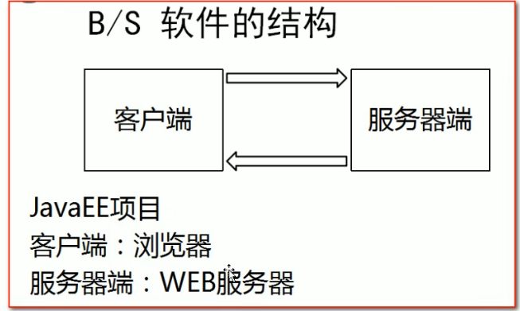
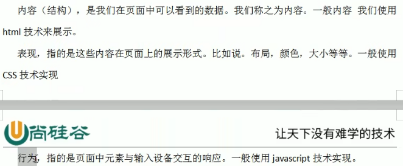
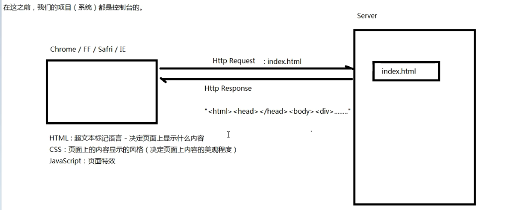
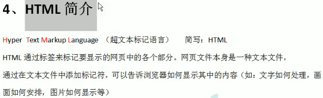
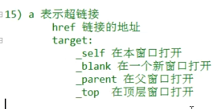
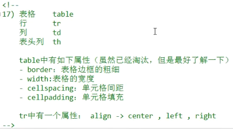
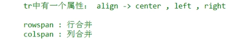

# JavaWeb

## 一,JavaWeb介绍:

### 1.javaWeb前言:

#### 1.,什么是javaWeb:



### 2.B/S软件结构

说白了就是客户端是浏览器 服务器端是web服务器



### 3.HTML,CSS,Javascript是什么意思:

页面有三个元素:内容,表现,行为,分别由html,css,javascript实现

实现:

## 二,HTML:

### 1.为什么存在:



### 2.基础标签:

```html
<html>
	<head>
		<title>Hello</title>
		<meta charset="UTF-8">
	</head>
	<body>
		Hello world!<br/>你好!
		<p>段落</p>
		
        <h1>
            标题一
        </h1>
        <h2>
            标题二
        </h2>
        武林高手排行榜:
        <ol type="A" start="3">
            <li>扫地僧</li>
            <li>萧远山</li>
        </ol>
        武林大会人员名单
        <ul type="circle">
            <li>乔峰</li>
            <li>阿朱</li>
        </ul>
        
        你是<b><i><u>喜欢</u></i></b>是<b>甜</b><br/>
        O<sup>2</sup><br/>
        H<sub>2</sub>O<br/>
        <a href="http://www.baidu.com" target="_blank">百度一下</a>
        
        <div id="div1">div1</div>
	</body>
	
</html>
```

#### html:html主界面标签

#### head:标签用于定义文档的头部，它是所有头部元素的容器

##### title:在<title>和</title>标签之间的文字内容是网页的标题信息

##### meta:代表要求接收方服务器编译的方式

#### body:网页的主要内容

##### p:<p>标签，添加段落。

##### img:图片标签

##### src属性表示图片文件的路径

###### width和height表示图片的长度和高度

###### alt表示图片未显示的提示

###### title是鼠标指向图片显示的名称

##### br/:表示隔行

##### h1-6:标题的显示

##### ol:列表标签(order list)

###### -->start:表示从什么开始

###### -->type:显示的类型,有5种A a I i 1

##### ul:无序列表标签(unordered list)

###### type:列表列的类型

##### 对字体的操作:

###### u代表下划线 b代表粗体 i代表斜体

##### 字符实体:即加减乘除大于小于

具体在:[HTML 字符实体 (w3school.com.cn)](https://www.w3school.com.cn/html/html_entities.asp)

##### span:不换行的块标记

##### 超链接:



##### div:层(暂时x)

注意:html是解释型语言,即便出错了仍然能够运行,而java是编译型语言,不能有错误

### 3.table标签:

```html
<html>
	<head>
        <title>表格标签的学习</title>
        <meta charset="UTF-8">
	</head>
	<body>
        <table border="1" width="600" cellspacing="0" cellpadding="4">
            <tr align="center">
                <th>姓名</th>
                <th>门派</th>
            </tr>
            <tr align="center">
                <td>乔峰</td>
                <td>丐帮</td>
            </tr>
            <tr align="center">
                <td>虚竹</td>
                <td>林工</td>
            </tr>
            <tr align="center">
                <td>扫地僧</td>
                <td>少林寺</td>
            </tr>
        </table>
	</body>
	
</html>
```




```html
        <table border="1" width="600" cellpadding="4" cellspacing="0">
            <tr align="center">
                <th>名称</th>
                <th>单价</th>
                <th>数量</th>
                <th>小计</th>
                <th>操作</th>
            </tr>
            <tr align="center">
                <td>苹果</td>
                <td rowspan="2">5</td>
                <td>20</td>
                <td>100</td>
                <td>删除</td>
            </tr>
            <tr align="center">
                <td>梨子</td>
                <!--                <td>5</td>-->
                <td>100</td>
                <td>200</td>
<!--                <td>删除</td>-->
                <td></td>
            </tr>
            <tr align="center">
                <td>西瓜</td>
                <td>6</td>
                <td>200</td>
                <td>30</td>
                <td>删除</td>
            </tr>
            <tr align="center">
                <td>总计</td>
                <td colspan="4">181</td>
            </tr>
        </table>
```

其中删除操作的图片显示:可以直接在行中导入图片



### 4.表单标签:

##### form:表单主体

```html
<html>
    <head>
        <title>表格标签的学习</title>
        <meta charset="UTF-8">
    </head>
    <body>
    <!--action代表的是提交之后进入的html文件-->
    <!--method="get",如果通过这里的注册跳到其他的web界面,web地址会暴露文件位置,不安全-->
        <form action="hello4.html" method="post">
            <!--input的子类:

                type代表的是你需求的文本框类型
                name代表的是该名称的标签,即发出的种类名称
                value代表的是该内容的返回值,下面的名称的value是默认值,可以更改
                checked代表的是该内容的默认值,当没有用checked="checked"时,实际上代表的是该值为默认值

            -->
            名称: <input type="text" name="nickName" value="请输入你的昵称"/><br/>
            密码: <input type="password" name="pwd"/><br/>
            性别: <input type="radio" name="gender" value="male"/>男
                  <input type="radio" name="gender" value="female" checked/>女<br/>
            爱好: <input type="checkbox" name="hobby" value="basketball" checked>篮球
                 <input type="checkbox" name="hobby" value="football" checked>足球
                 <input type="checkbox" name="hobby" value="badminton">羽毛球<br/>
            星座: <select name="star">
                    <option>白羊座</option>
                    <option>天蝎座</option>
                    <option>双鱼座</option>
                </select><br/>
            备注: <textarea name="remark" rows="4" cols="50"></textarea><br/>
            <input type="submit" value=" 注 册 "/>
            <input type="reset" value=" 重置 "/>
            <input type="button" value=" 这是一个普通按钮 "/>
        </form>
    </body>

</html>
```


name 属性规定 input 元素的名称。  name 属性用于对提交到服务器后的表单数据进行标识，或者在客户端通过 JavaScript 引用表单数据。

<<<<<<< HEAD
<<<<<<< HEAD
=======

>>>>>>> c576ce0 (new try)
=======

>>>>>>> c576ce01619128b884fb07633cf06f9d682e6dab
