# Maven:参考视频:[尚硅谷2022版Maven教程（maven入门+高深，全网无出其右！）_哔哩哔哩_bilibili](https://www.bilibili.com/video/BV12q4y147e4?spm_id_from=333.788.b_636f6d6d656e74.26&vd_source=ad51d878f79661f748870c8eb48188e1)==总的==

## 新手:参考[03-Maven安装&配置及基本使用_哔哩哔哩_bilibili](https://www.bilibili.com/video/BV1Qf4y1T7Hx?p=44&spm_id_from=pageDriver&vd_source=ad51d878f79661f748870c8eb48188e1)

### 1.Maven前言:

#### 1.1、为什么会有Maven:

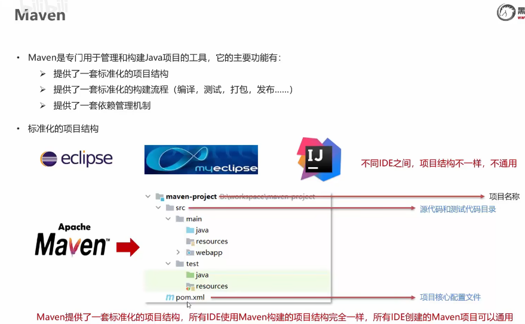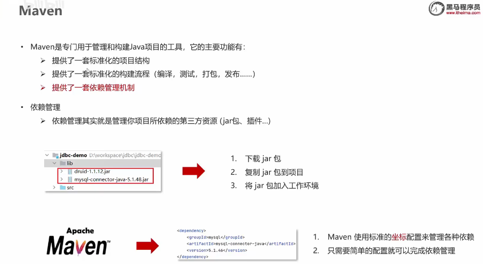

### 2.Maven简介:

#### 2.1、Maven模型: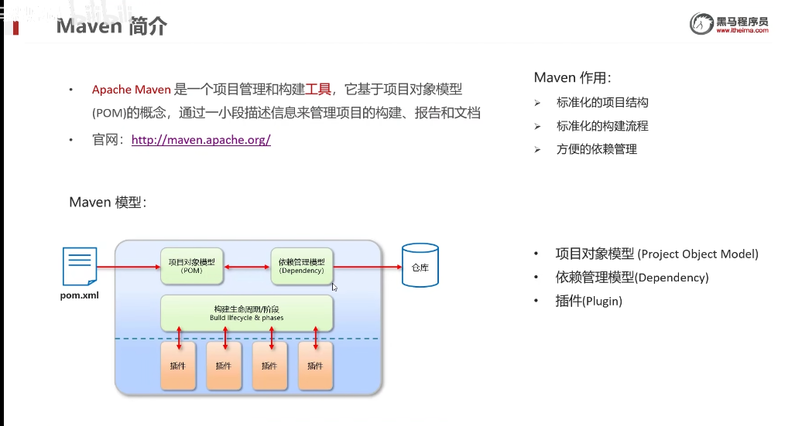

#### 2.2、Maven的配置文件的解读:

1. 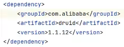

   解读:对应的是maven本地文件的本地仓库的com\alibaba\druid\1.1.12文件

#### 2.3、Maven仓库的类别:

1. 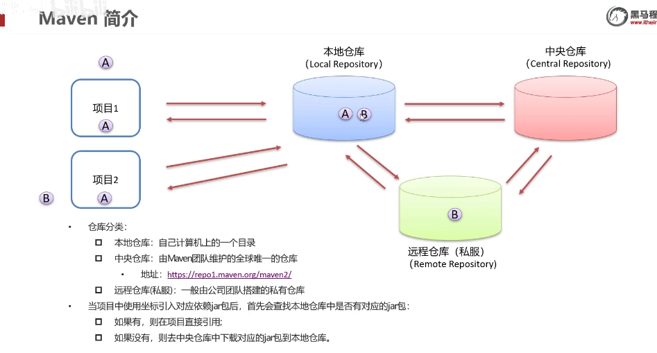
2. ==当没有私服时,项目1会先从本地仓库寻找配置文件坐标锁定的jar包,没有则从中央仓库中查找并将其保存在本地仓库,然后再由项目对其进行引用==
3. ==当有私服时,本地仓库->私服->中央仓库->文件下载到远程仓库->本地仓库在下载远程仓库==

#### 2.4、Maven安装配置:

##### 配置环境:

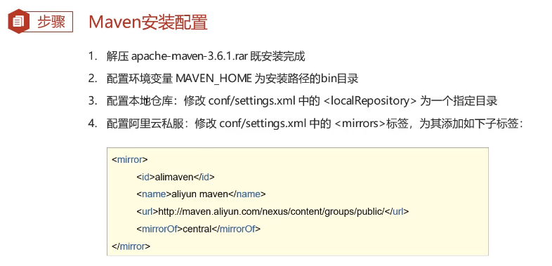

##### 本地仓库的位置:

###### 默认位置:C:\Users\86137\.m2\repository

###### 建议设置位置:Maven根目录下

### 3.Maven 基本使用:

#### 3.1、Maven常用命令:

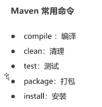

##### compile使用:

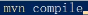

注意:这些命令在maven仓库连接阿里云服务器下载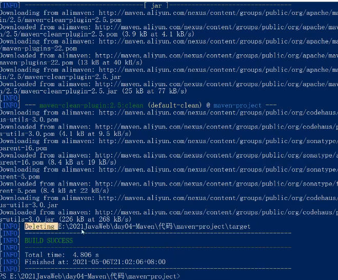

##### install使用

install是将文件下载到本地仓库里:

注意:本地仓库文件测试是在下面的路径

E:\Workspace\apache-maven-3.8.6\mvn_resp\org\example\maven_mode\1.0-SNAPSHOT

#### 3.2、IDEA配置Maven

##### 3.2.1 Maven坐标详解:

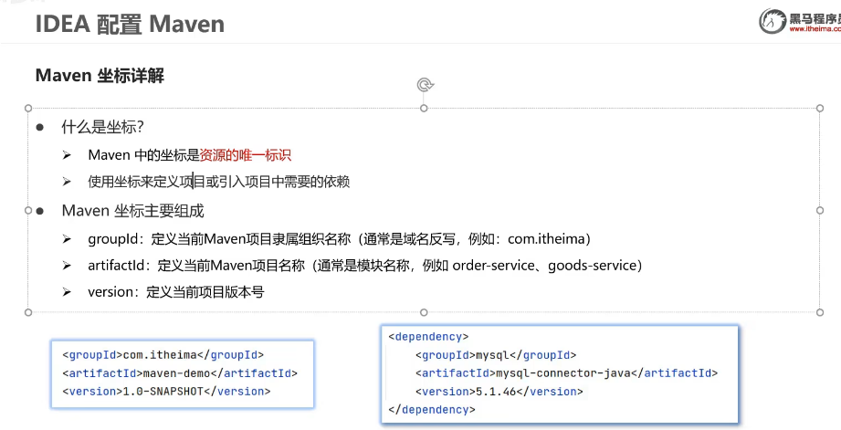

##### 3.2.2 IDEA创建Maven项目

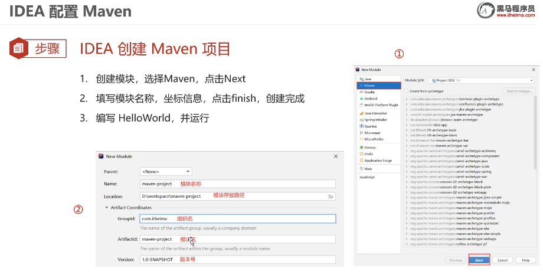

##### 3.2.3 IDEA导入Maven项目

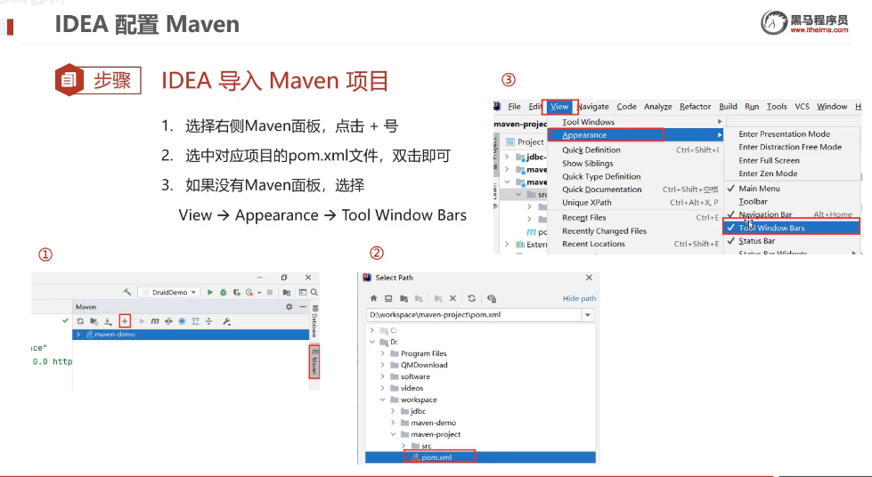

##### 3.2.4 依赖管理:

[05-依赖管理&依赖范围_哔哩哔哩_bilibili](https://www.bilibili.com/video/BV1Qf4y1T7Hx?p=46&spm_id_from=pageDriver&vd_source=ad51d878f79661f748870c8eb48188e1)

###### 坐标导入:

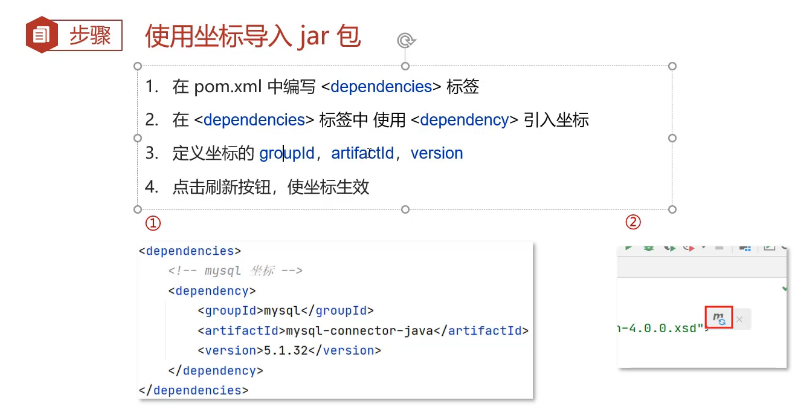

###### 自动导入(不建议):

不建议的原因是如果不小心输错了,IDEA会自动导入,这样的话很容易内存会满

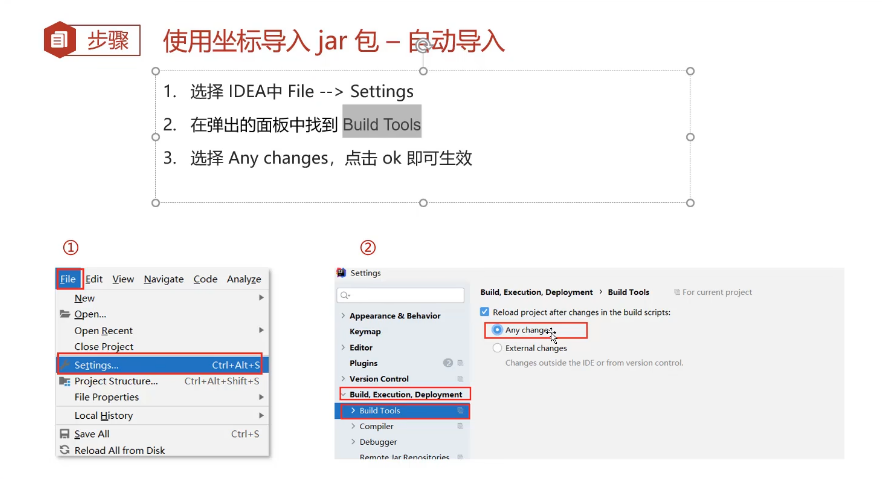

###### Dependency快捷导入:

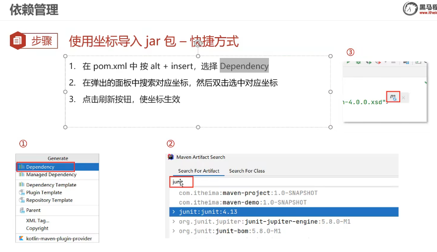

###### 依赖范围:

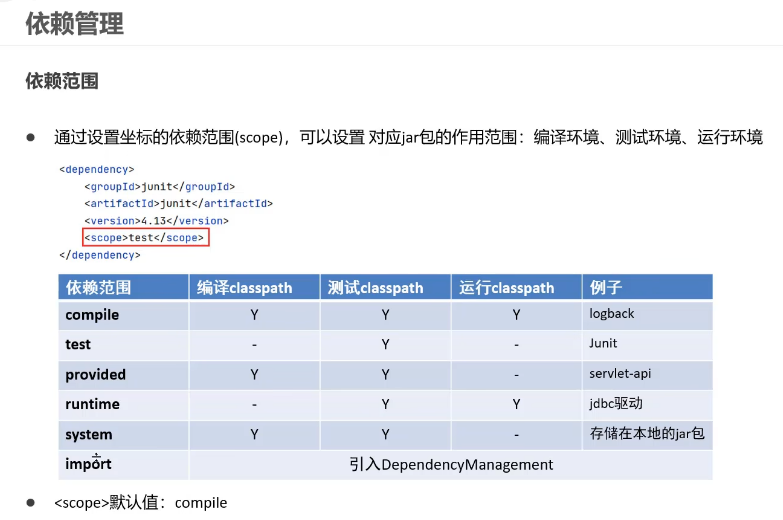

依赖范围类似于权限,分为编译,运行,测试的使用背景 scope默认是compile

要注意运行的依赖范围

## 进阶:

## 深入:

