# MyBatis框架:参考视频:[006-搭建MyBatis框架之开发环境和准备工作_哔哩哔哩_bilibili](https://www.bilibili.com/video/BV1Ya411S7aT?p=6&spm_id_from=pageDriver&vd_source=ad51d878f79661f748870c8eb48188e1)

## 1,MyBatis简介:

### 1.1,MyBatis历史:

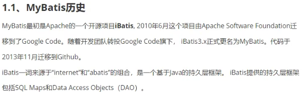

### 1.2,==MyBatis特性==:

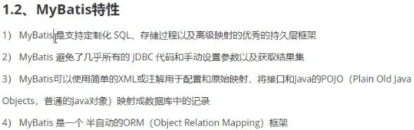

### 1.3,MyBatis和其他持久化层技术对比:

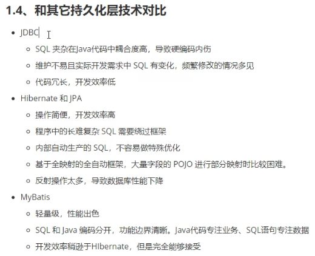

## 2,Mybatis配置开发环境:

### 2.1,搭建maven工程:

#### 引入依赖:

先用maven导入三个jar包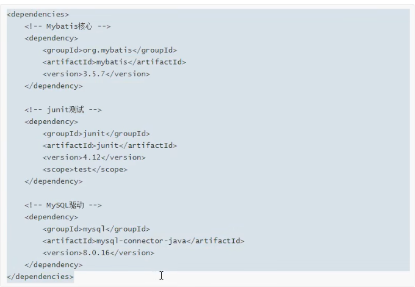

### 2.2,搭建数据库

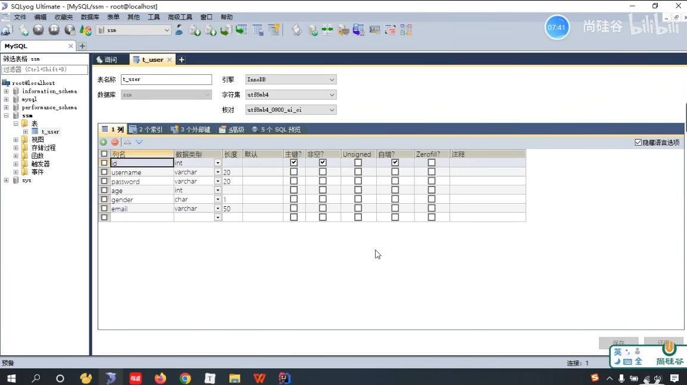

### 2.3 ,MyBatis的配置文件

核心配置文件设置如何连接数据库,映射文件设置如何使用数据库 

#### 2.3.1,创建核心配置文件的设置:

创建文件位置如下

需要创建

#### 2.3.2,创建映射配置文件的设置:

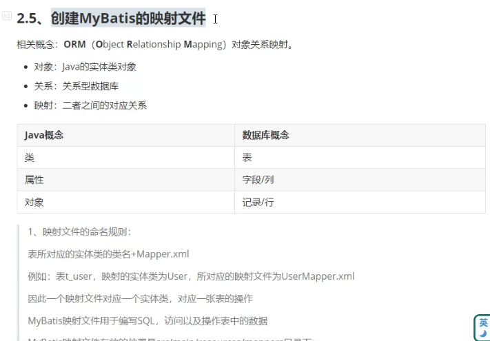

##### 概念:对象关系映射

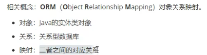

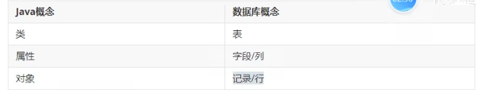

注意:映射的实体类最好跟映射文件名字相同

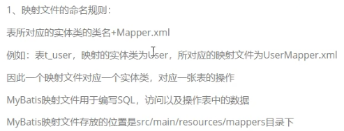

##### 概念:DTD文件和XML文件

XML文件是配置文件,DTD文件是XML的一个外部引用

##### ==注意点:保证两个一致(可以看映射配置文件代码块)==

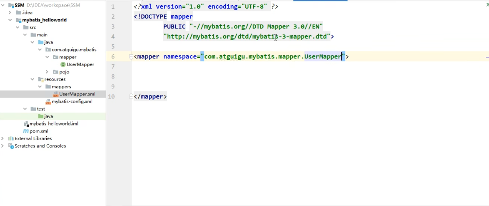

##### ==核心配置文件代码块==:

```java
<?xml version="1.0" encoding="UTF-8" ?>
<!DOCTYPE configuration
        PUBLIC "-//mybatis.org//DTD Config 3.0//EN"
        "http://mybatis.org/dtd/mybatis-3-config.dtd">
<configuration>

    <!--
        MyBatis核心配置文件中，标签的顺序：
        properties?,settings?,typeAliases?,typeHandlers?,
        objectFactory?,objectWrapperFactory?,reflectorFactory?,
        plugins?,environments?,databaseIdProvider?,mappers?
    -->

    <!--引入properties文件-->
    <properties resource="jdbc.properties" />

    <!--设置类型别名-->
    <typeAliases>
        <!--
            typeAlias：设置某个类型的别名
            属性：
            type：设置需要设置别名的类型
            alias：设置某个类型的别名，若不设置该属性，那么该类型拥有默认的别名，即类名
            且不区分大小写
        -->
        <!--<typeAlias type="com.atguigu.mybatis.pojo.User"></typeAlias>-->
        <!--以包为单位，将包下所有的类型设置默认的类型别名，即类名且不区分大小写-->
        <package name="com.atguigu.mybatis.pojo"/>
    </typeAliases>

    <!--
        environments：配置多个连接数据库的环境
        属性：
        default：设置默认使用的环境的id
    -->
    <environments default="development">
        <!--
            environment：配置某个具体的环境
            属性：
            id：表示连接数据库的环境的唯一标识，不能重复
        -->
        <environment id="development">
            <!--
                transactionManager：设置事务管理方式
                属性：
                type="JDBC|MANAGED"
                JDBC：表示当前环境中，执行SQL时，使用的是JDBC中原生的事务管理方式，事
                务的提交或回滚需要手动处理
                MANAGED：被管理，例如Spring
            -->
            <transactionManager type="JDBC"/>
            <!--
                dataSource：配置数据源
                属性：
                type：设置数据源的类型
                type="POOLED|UNPOOLED|JNDI"
                POOLED：表示使用数据库连接池缓存数据库连接
                UNPOOLED：表示不使用数据库连接池
                JNDI：表示使用上下文中的数据源
            -->
            <dataSource type="POOLED">
                <!--设置连接数据库的驱动-->
                <property name="driver" value="com.mysql.jdbc.Driver"/>
                <!--设置连接数据库的连接地址-->
                <property name="url" value="jdbc:mysql://localhost:3306/ssm?useUnicode=true&amp;characterEncoding=utf8&amp;useSSL=false&amp;serverTimezone=UTC"/>
                <!--设置连接数据库的用户名-->
                <property name="username" value="root"/>
                <!--设置连接数据库的密码-->
                <property name="password" value="123456"/>
            </dataSource>
        </environment>

        <environment id="test">
            <transactionManager type="JDBC"/>
            <dataSource type="POOLED">
                <!--设置连接数据库的驱动-->
                <property name="driver" value="${jdbc.driver}"/>
                <!--设置连接数据库的连接地址-->
                <property name="url" value="${jdbc.url}"/>
                <!--设置连接数据库的用户名-->
                <property name="username" value="${jdbc.username}"/>
                <!--设置连接数据库的密码-->
                <property name="password" value="${jdbc.password}"/>
            </dataSource>
        </environment>
    </environments>

    <!--一定要做的,即要在核心配置文件中引入映射文件-->

    <!--个人认为核心配置文件主要是准备连接数据库的必要参数,
    而映射文件是准备java使用接口从而调用映射配置文件中的sql语句-->

    <!--引入映射文件-->
    <mappers>
        <mapper resource="mappers/UserMapper.xml"/>
        <!--
            以包为单位引入映射文件
            要求：
            1、mapper接口所在的包要和映射文件所在的包一致
            2、mapper接口要和映射文件的名字一致
        -->
        <!--<package name="com.atguigu.mybatis.mapper"/>-->
    </mappers>

</configuration>
```

注意:核心配置文件中的mapper resource的默认目录是maven目录下的resources文件

#####  ==映射配置文件代码块==:

```java
<?xml version="1.0" encoding="UTF-8" ?>
<!--XML文件的声明(第一行)-->
<!--一个约束引入DTD文件-->
<!DOCTYPE mapper
        PUBLIC "-//mybatis.org//DTD Mapper 3.0//EN"
        "http://mybatis.org/dtd/mybatis-3-mapper.dtd">
<!--映射语句里面主要写的是sql语句-->
<!--要保证namespace和mapper接口的全位名(路径)一致-->
<mapper namespace="com.Ly241.mybatis.mapper.UserMapper">

<!--要保证sql语句中的id名和UserMapper接口里面的方法名保持一致-->
    <!--int insertUser是方法名,-->
    <insert id="insertUser">
        insert into t_user values(null,'admin','123456')
    </insert>
</mapper>
<!--注意:该配置文件主要是为了让类调用接口时,会在这映射配置文件中找对应sql语句
    说白了就是将idea中java调用接口跟sql语句建立桥梁-->
```

##### ==对映射文件和核心文件配置的总结==:

总体是==先配置好核心文件找到映射文件,通过接口的全类名找到映射文件,再通过接口的全位方法找到映射文件中的sql语句执行并返回==

##### 可能出现的bug解决方法:

出现下面这种bug,主要是核心配置文件写错了,如下分析是找不到t_user文件,因为核心配置文件中的url索引错了数据库或者数据库的表,故需要修改核心文件的url

```java
Loading class `com.mysql.jdbc.Driver'. This is deprecated. The new driver class is `com.mysql.cj.jdbc.Driver'. The driver is automatically registered via the SPI and manual loading of the driver class is generally unnecessary.
org.apache.ibatis.exceptions.PersistenceException: 
### Error updating database.  Cause: java.sql.SQLSyntaxErrorException: Table 'jdbcstudy.t_user' doesn't exist
### The error may exist in mappers/UserMapper.xml
### The error may involve defaultParameterMap
### The error occurred while setting parameters
### SQL: insert into t_user values(null,'admin','123456',23,'男','12345@qq.com')
### Cause: java.sql.SQLSyntaxErrorException: Table 'jdbcstudy.t_user' doesn't exist
```

出现下面这种bug,主要原因是新的mysql版本已经更新了地址,需要更新新的driver

```java
Loading class `com.mysql.jdbc.Driver'. This is deprecated. The new driver class is `com.mysql.cj.jdbc.Driver'. The driver is automatically registered via the SPI and manual loading of the driver class is generally unnecessary.
```

更改核心设置里面的连接数据库的driver,由com.mysql.jdbc.Driver改成com.mysql.cj.jdbc.Driver

#### 2.3.3,Test测试文件(在test里的):

```java
package com.Ly241.mybatis.test;

import com.Ly241.mybatis.mapper.UserMapper;
import org.apache.ibatis.io.Resources;
import org.apache.ibatis.session.SqlSession;
import org.apache.ibatis.session.SqlSessionFactory;
import org.apache.ibatis.session.SqlSessionFactoryBuilder;
import org.junit.Test;

import java.io.IOException;
import java.io.InputStream;

public class MyBatisTest {

    @Test
    public void testInsert() throws IOException {
        //获取核心配置文件的输入流(读入)
        InputStream is = Resources.getResourceAsStream("mybatis-config.xml");
        //获取SqlSessionFactoryBuilder对象(该对象类似构造器,用来创建SqlSessionFactory对象)
        SqlSessionFactoryBuilder sqlSessionFactoryBuilder = new SqlSessionFactoryBuilder();
        //获取SqlSessionFactory对象(该对象是工厂模式,用来创建SqlSession对象)
        SqlSessionFactory build = sqlSessionFactoryBuilder.build(is);
        //获取sql的会话对象SqlSession,是Mybatis提供的操作数据库的对象
        SqlSession sqlSession = build.openSession();
        //获取UserMapper的代理实现类对象
        // (从这里就可以看出映射配置文件该在哪里使用了)
        UserMapper mapper = sqlSession.getMapper(UserMapper.class);
        //调用mapper接口中的方法实现添加用户信息的功能
        int result = mapper.insertUser();
        System.out.println("结果:" + result);
        //提交事务
        sqlSession.commit();
        //关闭sqlSession
        sqlSession.close();
    }

}
```

###### 总结:

​       核心配置文件的输入流->

​		getResourceAsStream

​       创建SqlSession构造器->获取工厂模式的对象传入输入流->创建SqlSession对象->获取代理实现类对象

​		SqlSessionFactoryBuilder->SqlSessionFactory->SqlSession->getMapper

#### 2.3.4,对Test文件执行的另一种代码及==优化==:

##### sqlSession对方法的直接使用

首先先注意:之前是创建了mapper对象再使用方法,而这个是直接使用锁定方法

获取完sql的会话对象SqlSession,使用对象自带的insert功能(这是自带的,需要绑定方法的位置)(位置是默认在java下)

```java
        SqlSession sqlSession = build.openSession();
        int result = sqlSession.insert("com.Ly241.mybatis.mapper.UserMapper.insertUser");
```

##### 自动提交事务的开启:

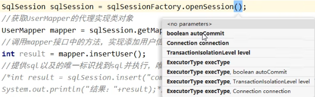

只需要在openSession()中开启true

##### 提供日志功能(log4j):

###### 依赖要先写入核心配置文件

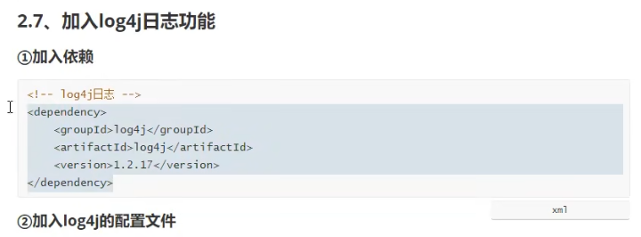

###### 其次要在resources文件里加入log4j.xml配置文件([Log4J.xml配置详解 - 腾讯云开发者社区-腾讯云 (tencent.com)](https://cloud.tencent.com/developer/article/1534762))

```xml
<?xml version="1.0" encoding="UTF-8"?>
<!DOCTYPE log4j:configuration SYSTEM "log4j.dtd">

<log4j:configuration xmlns:log4j='http://jakarta.apache.org/log4j/' >

    <appender name="myConsole" class="org.apache.log4j.ConsoleAppender">
        <layout class="org.apache.log4j.PatternLayout">
            <param name="ConversionPattern"
                   value="[%d{dd HH:mm:ss,SSS\} %-5p] [%t] %c{2\} - %m%n" />
        </layout>
        <!--过滤器设置输出的级别-->
        <filter class="org.apache.log4j.varia.LevelRangeFilter">
            <param name="levelMin" value="debug" />
            <param name="levelMax" value="warn" />
            <param name="AcceptOnMatch" value="true" />
        </filter>
    </appender>

    <appender name="myFile" class="org.apache.log4j.RollingFileAppender">
        <param name="File" value="D:/output.log" /><!-- 设置日志输出文件名 -->
        <!-- 设置是否在重新启动服务时，在原有日志的基础添加新日志 -->
        <param name="Append" value="true" />
        <param name="MaxBackupIndex" value="10" />
        <layout class="org.apache.log4j.PatternLayout">
            <param name="ConversionPattern" value="%p (%c:%L)- %m%n" />
        </layout>
    </appender>

    <appender name="activexAppender" class="org.apache.log4j.DailyRollingFileAppender">
        <param name="File" value="E:/activex.log" />
        <param name="DatePattern" value="'.'yyyy-MM-dd'.log'" />
        <layout class="org.apache.log4j.PatternLayout">
            <param name="ConversionPattern"
                   value="[%d{MMdd HH:mm:ss SSS\} %-5p] [%t] %c{3\} - %m%n" />
        </layout>
    </appender>

    <!-- 指定logger的设置，additivity指示是否遵循缺省的继承机制-->
    <logger name="com.runway.bssp.activeXdemo" additivity="false">
        <appender-ref ref="activexAppender" />
    </logger>

    <!-- 根logger的设置-->
    <root>
        <priority value ="debug"/>
        <appender-ref ref="myConsole"/>
        <appender-ref ref="myFile"/>
    </root>
</log4j:configuration>
```

注意:特别容易出错,原因个人猜测可能是因为版本兼容

###### ==封装工具类(SqlSessionUtil):==

```java
    public static SqlSession getSqlSession(){
        SqlSession sqlSession = null;
        try {
            InputStream is = Resources.getResourceAsStream("mybatis-config.xml");
            SqlSessionFactoryBuilder sqlSessionFactoryBuilder = new SqlSessionFactoryBuilder();
            SqlSessionFactory build = sqlSessionFactoryBuilder.build(is);
            sqlSession = build.openSession(true);

        } catch (IOException e) {
            e.printStackTrace();
        }
        return sqlSession;
    }
```


#### 2.3.5,设置多个sql语句配置(前面的语句配置的测试是insert):

例子采取使用update语句

##### 修改映射配置文件(增添update,delete语句):

```sql
    <update id="updataUser">
        update t_user set username = 'root',password='123' where id = '1'
    </update>
```

delete大致相同

##### 增添接口方法:

```java
int updateUser();
```

##### 执行(Update和delete)类Test:

```java
    @Test
    public void testUpdate(){
        SqlSession sqlSession = SqlSessionUtil.getSqlSession();
        UserMapper mapper = sqlSession.getMapper(UserMapper.class);
        mapper.updateUser();
        sqlSession.close();
    }
```

##### ==设置查询功能的实现==:

跟上述无异

修改映射配置文件,增添接口方法,设置执行类

但是由于查找需要从数据库中调用出来并转换为java的类型,故需要对查询结果进行处理

所以就有了两种设置(注意:这两者只能有一个且必须有一个)

###### 设置resultType

设置结果类型,即查询的数据要转换为的java类型

```java
    <select id="getUserById" resultType="com.Ly241.mybatis.project.User">
        select * from t_user where id = 6;
    </select>
```

###### 设置resultMap(暂时不需要)

自定义映射,处理多对一或一对多的映射关系

###### 查询所有元素:

与上述差不多

修改映射配置:

```java
    <!--List<User> getAllUser-->
    <select id="getAllUser" resultType="com.Ly241.mybatis.project.User">
        select * from t_user
    </select>
```

增添接口方法(UserMapper):

```java
List<User> getAllUser();
```

执行:

```java
    @Test
    public void testGetAllUser(){
        SqlSession sqlSession = SqlSessionUtil.getSqlSession();
        UserMapper mapper = sqlSession.getMapper(UserMapper.class);
        List<User> list = mapper.getAllUser();
        Iterator<User> iterator = list.iterator();
        while(iterator.hasNext()){
            System.out.println(iterator.next());
        }
        sqlSession.close();
    }
```

#### 2.3.6,Mybatis核心配置文件的environments:

##### 一个完整的environments配置设计:

```xml
    <environments default="development">
        <!--
            environment：配置某个具体的环境
            属性：
            id：表示连接数据库的环境的唯一标识，不能重复
        -->
        <environment id="development">
            <!--
                transactionManager：设置事务管理方式
                属性：
                type="JDBC|MANAGED"
                JDBC：表示当前环境中，执行SQL时，使用的是JDBC中原生的事务管理方式，事
                务的提交或回滚需要手动处理
                MANAGED：被管理，例如Spring
            -->
            <transactionManager type="JDBC"/>
            <!--
                dataSource：配置数据源
                属性：
                type：设置数据源的类型
                type="POOLED|UNPOOLED|JNDI"
                POOLED：表示使用数据库连接池缓存数据库连接
                UNPOOLED：表示不使用数据库连接池
                JNDI：表示使用上下文中的数据源
            -->
            <dataSource type="POOLED">
                <!--设置连接数据库的驱动-->
                <property name="driver" value="com.mysql.cj.jdbc.Driver"/>
                <!--设置连接数据库的连接地址-->
                <property name="url" value="jdbc:mysql://localhost:3306/ssm?serverTimezone=Hongkong&amp;useUnicode=true&amp;characterEncoding=utf8&amp;useSSL=false&amp;serverTimezone=UTC"/>
                <!--设置连接数据库的用户名-->
                <property name="username" value="root"/>
                <!--设置连接数据库的密码-->
                <property name="password" value="123456"/>
            </dataSource>
        </environment>
    </environments>
```


##### environments的属性和id:

###### environments:

配置连接数据库的环境

###### default:

设置默认使用的环境的id

###### id:

id是设置环境的唯一标识,不能重复

##### transactionManager设置事务管理器:

###### type

设置事务管理的方式,其中只有两种方式:一种是JDBC,一种是MANAGED

###### type中的‘JDBC’

表示使用JDBC中原生的事务管理方式

###### 补充:原生的事务管理方式是什么:

Sqlsession中的回滚,自动提交事务都属于是原生的事务管理方式

###### MANAGED:

标识被管理,后面学习完spring,可以将jdbc交给Spring管理,此时就可以使用这个

##### dataSource设置数据源:

###### type解释:

设置数据源的类型

###### type能够使用的总类:

POOLED表示使用数据库连接池/UNPOOL表示不使用数据库连接池/JNDI表示使用上下文中的数据源

#### 2.3.7,Mybatis设置properties配置文件:

##### properties文件的作用是为了让mybatis核心文件的数据库环境变量(driver,url,username,password)得到封装

##### 引入properties

```xml
<properties resource="jdbc.properties"/>
```

##### properties文件:

```properties
jdbc.driver=com.mysql.cj.jdbc.Driver
jdbc.url=jdbc:mysql://localhost:3306/ssm?serverTimezone=UTC
jdbc.username=root
jdbc.password=123456
```

##### Mybatis文件中如何使用封装的数据库变量:

使用${key}的方式调用properties中的变量

```xml
<property name="driver" value="${jdbc.driver}"/>
```

#### 2.3.8,Mybatis核心配置文件中的typeAliases

typeAliases是用来对一个具体的类型设置类型别名,比如UserMapper.xml中的查找功能需要resultType返回一个具体的类型,这个类型可以用一个别名替代

##### Mybatis核心配置文件的标签顺序:

```
    <!--核心配置文件的标签必须按照指定的顺序配置:
    properties?,settings?,typeAliases?,typeHandlers?,objectFactory?
    ,objectWrapperFactory?,reflectorFactory?,plugins?,environments?
    ,databaseIdProvider?,mappers?-->
```

##### 核心文件中使用时要注意typeAliases的标签顺序,格式如下:

方法一:使用自己设置的别名

```xml
    <typeAliases>
        <typeAlias type="com.Ly241.mybatis.project.User" alias="abc"></typeAlias>
    </typeAliases>
```

type:设置需要起别名的类型

alias:设置某个类型的别名

对一个User类设置别名,名字叫abc

方法二:使用默认的别名,即其本身的类名:

```xml
<typeAliases>
    <typeAlias type="com.Ly241.mybatis.project.User"></typeAlias>
</typeAliases>
```

##### UserMapper.xml中的使用

如select操作:

方法一:

```xml
<select id="getUserById" resultType="abc">
```

或者

方法二:

```xml
<select id="getUserById" resultType="User">
```

##### 以包作为别名使用:

```xml
<!--如果表越多,实体类越多,就可以用以包为别名,该包下的所有的类都会有默认别名-->
```

```xml
<typeAliases>
    <package name="com.Ly241.mybatis.project"/>
</typeAliases>
```

#### 2.3.9,Mybatis核心配置文件中的mappers

主要作用是在核心配置文件中以包的方式引入映射文件,而不是直接引用映射文件

```xml
    <!--引入映射文件-->
    <mappers>
        <!--<mapper resource="mappers/UserMapper.xml"/>-->
        <!--
            以包为单位引入映射文件
            要求：
            1、mapper接口所在的包要和映射文件所在的包一致
            2、mapper接口要和映射文件的名字一致
        -->
        <package name="com.Ly241.mybatis.mapper"/>
    </mappers>
```

这样的话只需要将映射文件放进com.Ly241.mybatis.mapper中,就可以引入(不需要手动设置了)

#### 总结Mybatis的配置文件:

##### 可以直接使用idea的配置模板功能,不用复制,直接使用即可

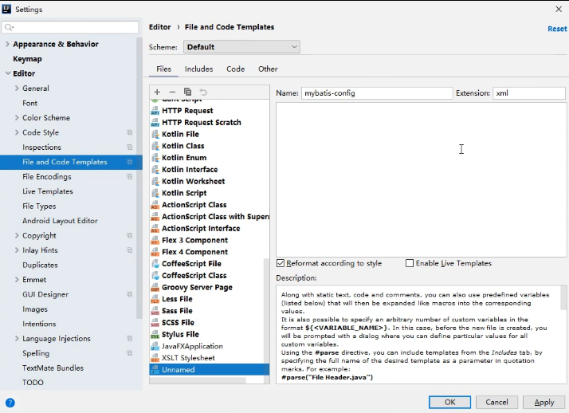

注意:Name只是一个模板名字,形成模板后还得自己进行修改

```xml
<?xml version="1.0" encoding="UTF-8" ?>
<!DOCTYPE configuration
        PUBLIC "-//mybatis.org//DTD Config 3.0//EN"
        "http://mybatis.org/dtd/mybatis-3-config.dtd">
<configuration>

    <!--核心配置文件的标签必须按照指定的顺序配置:
    properties?,settings?,typeAliases?,typeHandlers?,objectFactory?
    ,objectWrapperFactory?,reflectorFactory?,plugins?,environments?
    ,databaseIdProvider?,mappers?-->


    <!--引入properties文件,使得在当前文件可以使用${key}的方式访问properties文件中的value-->
    <properties resource="jdbc.properties"/>

    <!--设置alias,可自定义别名,不设置alias,使用默认别名,即简化全类名-->
    <!--如果表越多,实体类越多,就可以用以包为别名,该包下的所有的类都会有别名-->
    <typeAliases>
        <typeAlias type="com.Ly241.mybatis.project.User"></typeAlias>
        <package name="com.Ly241.mybatis.project"/>
    </typeAliases>


    <environments default="development">
        <!--
            environment：配置某个具体的环境
            属性：
            id：表示连接数据库的环境的唯一标识，不能重复
        -->
        <environment id="development">
            <!--
                transactionManager：设置事务管理方式
                属性：
                type="JDBC|MANAGED"
                JDBC：表示当前环境中，执行SQL时，使用的是JDBC中原生的事务管理方式，事
                务的提交或回滚需要手动处理
                MANAGED：被管理，例如Spring
            -->
            <transactionManager type="JDBC"/>
            <!--
                dataSource：配置数据源
                属性：
                type：设置数据源的类型
                type="POOLED|UNPOOLED|JNDI"
                POOLED：表示使用数据库连接池缓存数据库连接
                UNPOOLED：表示不使用数据库连接池
                JNDI：表示使用上下文中的数据源
            -->
            <dataSource type="POOLED">
                <!--设置连接数据库的驱动-->
                <property name="driver" value="${jdbc.driver}"/>
                <!--设置连接数据库的连接地址-->
                <property name="url" value="${jdbc.url}"/>
                <!--设置连接数据库的用户名-->
                <property name="username" value="${jdbc.username}"/>
                <!--设置连接数据库的密码-->
                <property name="password" value="${jdbc.password}"/>
            </dataSource>
        </environment>
    </environments>

    <!--一定要做的,即要在核心配置文件中引入映射文件-->

    <!--个人认为核心配置文件主要是准备连接数据库的必要参数,
    而映射文件是准备java使用接口从而调用映射配置文件中的sql语句-->

    <!--引入映射文件-->
    <mappers>
        <!--<mapper resource="mappers/UserMapper.xml"/>-->
        <!--
            以包为单位引入映射文件
            要求：
            1、mapper接口所在的包要和映射文件所在的包一致
            2、mapper接口要和映射文件的名字一致
        -->
        <package name="com.Ly241.mybatis.mapper"/>
    </mappers>

</configuration>
```

总体maven配置文件结构:

pom.xml负责导入核心,如Mybatis核心,junit测试等Maven仓库导入

log4j.xml是测试日志配置文件,负责运行时展现测试日志

mybatis-config是核心配置文件,主要是引入数据库连接和映射文件

jdbc.properties是jdbc封装

Usermapper.xml是映射文件,主要是sql语句操作

## 3,Mybatis实现:

### 3.1,Mybatis获取参数值的两种方式:


### 3.2Mybatis的单个字面量类型的参数:

#### 字面量类型的意思是基础数据类型+String都属于字面量,即能够一看便知的变量,如1,”abc”,’c’等

### 3.3Mybatis获取参数:

#### 使用字符串拼接完成getUserByUsername的动态查找:

```xml
<select id="getUserByUsername" resultType="User">
    select * from t_user where username = #{username}
</select>
```

通过UserMapper中的方法来获得User,注意:username是使用?的

```java
User getUserByUsername(String username);
```

#### 使用占位符拼接完成:

```xml
<select id="getUserByUsername" resultType="User">
    select * from t_user where username = '${username}'
</select>
```

使用占位符的方法是直接替换,故要加‘’,其中不能写数值
