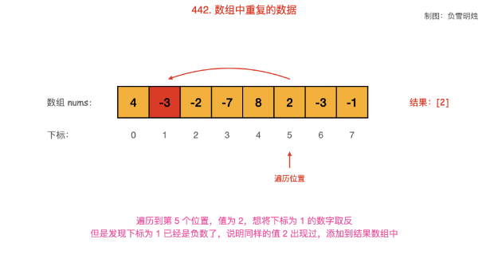

# 数组:

## 初学:

### 414

#### 解题(TreeSet解题): 

` class Solution {
    public int thirdMax(int[] nums) {
        if(nums != null){            
            TreeSet treeset = new TreeSet<Integer>();
            for(int num : nums){
                treeset.add(num);
                if(treeset.size() > 3){
                    treeset.remove(treeset.first());
                }
            }
            if(treeset.size() >= 3)return (Integer)treeset.first();
            else return (Integer)treeset.last();
        }
        return -1;
    }
}`

### 645

` class Solution {
    public int[] findErrorNums(int[] nums) {
        int[] sum = new int[2];
        int length = nums.length;
        int[] newnums = new int[length + 1];
        for(int x : nums){
            newnums[x]++;
        }
        for(int i = 1;i <= length;i++){
            if(newnums[i] == 0)sum[1] = i;
            if(newnums[i] == 2)sum[0] = i;
        }
        return sum;
    }
}`

### 697 利用滑动窗口

```java
int maxCount = 0,minWindow = 0;
HashMap<Integer,int[]> map = new HashMap<Integer,int[]>();
for(int i = 0;i < nums.length;i++){
    int[] arr = map.get(nums[i]);
    if(arr == null){
        //new int[]{i,1}:i记录第几位,负责解决最小距离,1是数量
        arr = new int[]{i,1};
        map.put(nums[i],arr);
    }else{
        arr[1]++;
    }

    if(maxCount < arr[1]){
        maxCount = arr[1];
        minWindow = i - arr[0] + 1;
    }else if(maxCount == arr[1]){
        minWindow = Math.min(i - arr[0] + 1,minWindow);
    }
}
return minWindow;
```

### 442.处理数组中重复的数据,且没有排序:(采用遍历一次并取反)

```java
        int length = nums.length;
        List<Integer> list = new ArrayList<>();
        for(int i = 0;i < length;i++){
            if(nums[Math.abs(nums[i]) - 1] < 0){
                list.add(Math.abs(nums[i]));
            }else{
                nums[Math.abs(nums[i]) - 1] *= -1;
            }
        }
        return list;
```

从起始位置进行遍历，每次将下标为 nums[i] - 1nums[i]−1 的数字取反；
当遍历到值 nums[i]nums[i] 为负数，需要忽略其负号。
若发现下标为 nums[i] - 1nums[i]−1 的数字已经是负数，说明之前出现过同样的数字 nums[i]nums[i]，即找到了重复数字；
总结:一开始都是正数,通过取反来获取遍历途中元素所指向的元素-1下标的元素并乘与-1,然后遍历的途中遇到是负数说明已经重复过了



