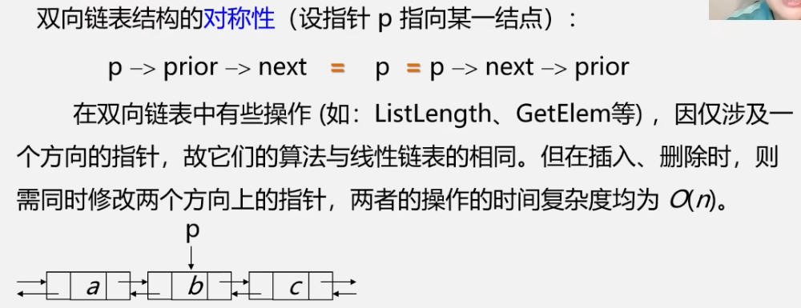

# 数据结构与算法

## 数据结构

### 一,数据结构概论

#### 1).数据结构的研究内容

1. 计算机解题的步骤:
2. x 1int maxCount = 0,minWindow = 0;2HashMap<Integer,int[]> map = new HashMap<Integer,int[]>();3for(int i = 0;i < nums.length;i++){4    int[] arr = map.get(nums[i]);5    if(arr == null){6        //new int[]{i,1}:i记录第几位,负责解决最小距离,1是数量7        arr = new int[]{i,1};8        map.put(nums[i],arr);9    }else{10        arr[1]++;11    }12​13    if(maxCount < arr[1]){14        maxCount = arr[1];15        minWindow = i - arr[0] + 1;16    }else if(maxCount == arr[1]){17        minWindow = Math.min(i - arr[0] + 1,minWindow);18    }19}20return minWindow;java

#### 2).数据的基本概念和术语

1. 数据:
2. 数据元素:
3. 数据项:
4. 数据对象:

5. 数据元素和数据对象:

### 二,数据结构的内容:

#### 1).数据结构的种类

1. 数据结构的三个方面:

+ 数据元素的逻辑关系
+ 数据元素及其关系在计算机内存中的标识的存储结构,物理结构
+ 对数据元素可以施加的操作的存储结构上的实现

2. 数据结构的两个层次:

   

3. 逻辑结构的种类(根据线性非线性划分):

   

4. 逻辑结构的种类(根据线性非线性划分):

5. 存储结构(四大基本):
   + 顺序存储结构:
   + 链式存储结构:
   + 索引存储结构:
   + 散列存储结构:

### 三,数据类型和抽象类型

#### 1).数据类型:

1. 引用:

2. 数据类型的定义:

3. 抽象数据类型的定义:

4. 基本操作:

#### 2).数据结构概念的总结:

#### 3).抽象数据类型:

1. 抽象数据类型的实现:

### 四,线性结构:

#### 1).线性表的定义和特点:

1. 线性表的定义:

2. 线性表的特点:

   

#### 2).线性表的基本操作:

1. + 初始化:
   + 销毁:
   + 清除:
   + 判断线性表是否为空:
   + 线性表的长度:
   + 取线性表中的第i个元素:
   + 通过数值搜索下标:
   + 获得当前元素的前驱:
   + 获得当前元素的后继:
   + 插入元素:
   + 删除元素:
   + 遍历:

#### 3).线性表的存储结构:

##### 1).顺序存储结构:

###### 1.顺序存储结构的理论定义:


1. 顺序存储结构的定义:注意:
   + 顺序存储结构所需的存储空间是连续的一片
   + 线性表中的每个元素的存储位置可以通过==第一个数据元素的存储位置+每一个元素所占用的存储单元==得到

2. ==故由上总结:每一个元素都可以通过类似等差数列的算法来计算,并且只需一次,所以时间复杂度为O(1)==

3. 虽然数组很像线性表,但是数组没有办法完成能够随意改变自身长度,故

+ 举例:

4. ==C语言实现顺序存储结构是通过数组动态分配做到的,而java则是在你创建的时候利用构造器来定义从而实现数组动态分配==

   C语言C++Java

###### 2.顺序存储结构实现的小结:

1. ==能够实现动态分配内存,也就是所谓的动态数组==
2. ==能够实现线性表的所有基本操作==

###### 3.顺序存储结构的物理层:

1. 顺序表的物理位序和逻辑位序:

###### 4.顺序表的实现:

1. 顺序表的预定义常量:

2. 顺序表的初始化:

3. 顺序表的销毁:

4. 线性表的清空:

5. 线性表的长度:

6. 判断线性表L是否为空:

7. 顺序表的取值:

8. 顺序表的查找:

   ==注意:这里的查找时间复杂度是根据查找的元素所决定的时间,需要引入平均查找长度这一概念==:==P代表查找成功的概率,C代表查找的元素==

9. 顺序表的插入:注意:==插入是只能插入在0-n+1的位置,n是最后元素的位置==

10. 顺序表的删除:

    

###### 顺序表总结:

1. 优缺点:
2. 特点:
3. 顺序表的时间和空间复杂度:

##### 2).链式存储结构:

###### 1.链式存储结构的理论定义:

+ 顺序存储和链式存储区别:

1. 链式存储结构:

2. 单链式存储结构的理论定义:

3. 单链表,双链表,循环链表的区别:

4. 链表的各个元素:注意:==头节点通常不会是首元结点(第一个元素所在位置)==
   + 带头节点和不带头节点:
   + 空表的实现:
   + ==带头结点的好处:==

5. 链表的特点:

   注意:

   1.顺序表是随机存取,链表是顺序存取

   2.头节点不参与表长的计算

###### 2.单链表的实现:

1. 单链表的存储结构:

2. 单链表元素存储数据的建议操作:==如果有多个数据,可以把多个数据整合到一个模块,然后将这个模块再写入链表的数据域中==

3. 单链表基本操作:

   + 初始化:

   + 判断是否为空:

   + ==销毁单链表:==注意:==销毁单链表是需要从头节点一点一点往后删除的,个人认为:原因在于链表元素的存储并不是按照一整个内存块存储,而是分开存储,所以即使直接删除了头节点,其他结点也会一直存在==

   + ==清空链表:==注意:==删除的关键是让链表变成空表==

     ==而空表的特征是只有头节点且没有数据==

     ==其次执行中由于需要在删除之前要能够继续获取下一个节点的数据,需要用两个指针来操作==

   + 单链表的表长(遍历):

   + 取单链表的第i个元素:

   + 按值查找:

   + ==插入元素:==

     注意:插入的时候要考虑到非法操作,==插入算法中i的合理取值范围是1到n+1==

   + ==删除第i个节点:==注意:删除这个节点的操作是链接跳过该节点且==释放该节点内存====而删除算法中i的合理取值范围为1到n==

4. 插入,删除,查找算法时间效率分析:

###### 3.==单链表头插法建立:==

1. 原理:从==头节点的尾部==不断插入新元素

2. C实现源码:

###### 4.==单链表尾插法建立:(之前使用的方法就是尾插法)==

1. 原理:==由头节点开始,一直添加新元素且向后递归==
2. 实现:

###### 5.循环链表:

1. 定义:其中空表的定义:==头节点的指针指向头节点本身便是空表==

2. ==遍历操作:==

   ==如果仍然是从头指针开始遍历,那么首尾的时间复杂度是====而如果是在尾指针开始遍历的话,那么首尾的时间复杂度会降低一个梯次:==

3. ==两个循环链表的合并操作(四部):==

   实现:

###### 6.双向链表:

1. 双向链表的优点:

2. 定义:

3. ==双向链表的插入:==关键在于==p节点的确定== 和==x的插入顺序==

   实现:

4. ==双向链表的删除操作:==

###### 7.双向循环链表:

1. 定义(结构):
2. 双向循环链表的特点(对称性):

###### 8.单链表,循环链表,双向链表时间效率:


##### 3).顺序表和链表的比较:

###### 1.链式存储结构的优点和缺点

1. 对于存储密度:

###### 2.顺序表和链表的比较:


##### 4).线性表的应用:

###### 线性表的合并:

###### 有序表的合并:

1. ==顺序表的合并:有序(其实就是双指针算法)==

2. 链表的合并:注意:==

   实践:

###### 多项式运算:

==对待这种跨越有顺序且相对靠近的多项式,可以采用数组,下标记录幂次,元素记录常数项==


###### 稀疏多项式运算:


==由于稀疏多项式需要记录两个值,如果使用数组下标和元素的方式记录,会造成很大内存浪费,其次这个新数组的大小需要能够动态变化,故采用链表==


##### 线性表的章节任务:

###### 图书管理系统:


#### 4).栈和队列:

##### 1).栈:

###### 栈的定义和特点:

1. 定义:栈的表示为了方便可视化,会把栈竖起来,栈底(表头)朝下,栈顶(表尾)朝上

   注意:每次都是在栈顶入栈和出栈

   入栈:

   出栈:

   

2. 特点:后进先出

3. 使用背景:

4. 栈与线性表的比较:

###### 栈的抽象数据类型:

1. 类型定义:
1. 操作使用:(八大操作)

###### ==顺序栈的表示和实现:==

1. 存储方式:
1. 栈的使用:注意:栈内存满了再进栈导致溢出是上溢(==属于问题处理错误==),栈没有元素再出栈导致溢出时下溢(==属于问题处理结束==)

3. 顺序栈的实现:
   + ==初始化:==
   + 判断是否为空:
   + 求元素数量:
   + 清空栈:
   + 销毁栈:==注意:delete 是释放内存==
   + ==入栈==:
   + ==出栈==:

###### 链栈的表示和实现:

1. 链栈的表示:

   注意:原先顺序栈的指针应该是由下指上,但是链表为了方便操作采用头插法

2. 链栈的初始化:

3. 链栈是否为空:

4. 链栈的入栈:注意:==先让p指针的next指向s指针,在让s指针指向p指针==

5. 链栈的出栈:

6. 取栈顶元素:

###### 多个函数的嵌套调用:

1.嵌套的使用


可以发现从多个函数调用遵循==后调用的先返回(也就是先进后出)==,是栈的特点

2.嵌套的底层实现:


##### 2).队列:

###### 队列的定义和特点:

1. 定义:
2. 特点:先进先出
3. 队列的相关概念:

###### 栈的抽象数据类型定义:

###### ==队列的顺序表示和实现:==

结构表示:

###### ==顺序队列的两个问题:==

第一个问题:顺序队列的==假上溢==

顺序队列的正常入队和出队:

可以看出上面有一个问题就是==如果当头指针在数组的最底层和尾指针在数组的最顶层,而下面的空间没有充分运用==,也就是==假上溢==

对此问题有两个方法:

+ 解决根本问题的方法

+ ==(实用)循环:==

  此时便可以引用==模运算==!

第二个问题:队列的队空和队满无法判断


###### 循环队列的实现:

1. 循环队列的类型定义:

2. 初始化:
3. 求长度:
4. ==入队==:
5. ==出队==:
6. 取队头元素:

###### ==链式队列的定义==:

1. 链队列的类型定义:

2. ==链队列的运算指针变化状况==:

###### 队列的链式表达和实现:

1. 链队列初始化:

   此处的!Q.front代表的Q.front空则退出

2. 链队列销毁:

3. 入队:注意:入队列是从队尾入

4. 出队:!

   注意:==需要考虑下一个出队的是尾节点的情况,故if(Q.rearp)就是考虑这个==

5. 取队头元素:

##### 3).栈和队列:

1. 

   

2. 栈和队列的引用案列:

   + 进制转换:

   + 括号匹配的检验:

     注意:先入栈的先匹配,后入栈的后匹配,

   + 表达式求值:
   
   + 舞伴问题:

#### 5).串,数组,广义表

##### 1.串

###### 串的定义:


###### 子串的定义:


###### 串的几个术语:


###### 串的案列引入:


###### 串的类型定义:


###### 顺序串的定义:


###### ==(块链结构串)==链式串的问题:

采用一个节点存储一个字符的方式的话,那么存储密度是1/5,存储密度太低

故通常会采用一个节点存储一个字符块,这就是块链结构串

###### 块链结构的定义:


##### 2.数组

###### 数组的定义:


###### 二维数组:

二维数组的结构


二维数组的定义


###### n维数组


###### n维数组的抽象数据类型


如何理解:下列bi代表了有多少个维度


需要完成的基本操作:


###### 数组的顺序存储:

1. 数组的特点:

   

2. 一维数组的存储:查看元素的方法,a[i] = a + i * L;

   

3. 二维数组的存储:二维数组的存储是通过以行/列为主序进行存储

4. 以行为主序的二维数组和以列为主序的二维数组:

5. 二维数组的计算元素位置:

6. 三维数组的存储方式:

7. n维数组的存储方式和存储位置计算:

   

###### 特殊矩阵的压缩存储:

1. 原理:

2. 定义:

3. 对称矩阵:

   

   

4. 三角矩阵:

   

5. 对角矩阵:

6. 稀疏矩阵:

###### ==稀疏矩阵的链式存储结构:十字链表==:

1. 十字链表的定义:
2. 十字链表的形成:注意:制作一个头节点元素数组,然后根据每一行或每一列通过指针索引一行或一列的指针

##### 3.广义表

###### 广义表的定义:


###### 注意一表尾一定是广义表

###### 注意二 长度是根据该表中的元素多少决定的,子表只算一个元素

###### 例子展示:


###### 广义表的特点(相对次序,长度,深度,共享,递归,多层次,):


###### 广义表与线性表的区别:


###### 广义表的基本运算:


### 五,非线性结构:

#### 1).树和二叉树:

##### 1.树:

###### 树的定义:


###### 树的示意图:


树有三种表达方式:嵌套集合,凹入表示,广义表

###### 树的基本术语:


结点:数据元素以及==指向子树的分支==

根结点:非空树中==无前驱==结点的结点

==结点的度==:结点拥有的==子树数==

==树的度==:树内各结点的==度的最大值==

###### 根据树的度可以分成两种类型

一种是度!=0分支结点非终端结点

一种是度=0(即叶子)是终端结点


###### 树的祖先,孩子,双亲,兄弟,堂兄弟:


###### 树的森林:


###### 线性结构和树结构的对比:


##### 2.二叉树:

###### 为什么要有二叉树:

对于普通树的算法实现非常困难且没有通用逻辑,且二叉树结构最简单

###### 二叉树的定义:


###### ==注意:二叉树不是树的特殊情况,因为要区分左右子树的次序==


###### 二叉树的五种形态和树的两种形态:


###### 二叉树的抽象数据类型定义:


###### 二叉树的性质:

性质1:二叉树的第i层至多有2的i-1个结点(i >=1),且最少有1个结点:


性质2:深度为k的二叉树==至多==有2的k-1个结点(k>=1):即总共有2的k-1个结点,==最少==也得有k层结点

性质3:对任何一棵二叉树T,如果其叶子树为n0,度为2的结点数为n2,则n0=n2+1

n2指的是能有两个结点的根数量,n1指的是只有一个的数量

###### 二叉树的存储结构:

1. 顺序存储:

2. 顺序存储的类型定义:

3. 顺序存储的实现:

   注意:二叉树的顺序存储是在一些情况下是不能直接存储的,比如下面这个例子

   这个例子呈现的问题是如果5和6号存储的是f和g,那么该二叉树的结构就成了完全二叉树,因为为了描述二叉树双亲和孩子的关系

4. 二叉树的顺序存储缺点:如果是最坏情况很浪费内存空间

   故只有在最好和较好情况才会使用这个

5. 链式存储的图示:

6. 链式存储的定义:

7. 链式存储中有n个结点的二叉链表,会有n+1个空指针域:

   链域是指存储链表元素指针的指针,n-1代表除了根节点之外的所有结点

###### 三叉链表:


注意:只有根节点的双亲为空,其他肯定有双亲结点

##### 3.满二叉树:

###### 学习的原因:


###### 定义:


例子:


##### 4.完全二叉树(满二叉树是特殊的完全二叉树):

###### 定义:

能够跟满二叉树的编号的结点一一对应,故每一个结点都应该一一对应


###### 特点:


###### 性质:

性质1(结点树n和深度k的关系):具有n个结点的完全二叉树的深度为[log2n] + 1


如何得出:


性质2(双亲结点编号和孩子结点编号):

##### 5.二叉树的递归遍历:

###### 二叉树为什么要遍历:


###### 遍历的方法:


###### 遍历有三种情况:


###### 遍历二叉树算法描述:


###### 先序遍历二叉树的例子:


###### 中序遍历二叉树的例子:


###### 后序遍历二叉树的例子:


###### 

###### 用二叉树表示算数表达式:


###### 根据遍历序列确定二叉树需要==中序序列==和==其他两个序列任意一个==:(有点类似于二分法的思想)


根据通过先序或后序找到的根,找出中序中根的位置进行分开


###### ==用递归实现二叉树先序遍历算法==:


###### 用递归实现二叉树中序遍历算法:


###### 用递归实现二叉树后序遍历算法:


###### 三种算法的总结:


实际上三种算法的访问路径完全相同,都是沿虚线路径走,只是操作的顺序不同

##### 6.二叉树的非递归遍历:

###### 中序遍历非递归算法思想:


###### 中序遍历非递归算法实现:


##### 7.二叉树的层次遍历:

###### 算法思想:(这里是用队列,其实可以用栈实现,可以思考一下如何实现)

利用队列,将根节点出队列,有左右孩子的入队列,持续下去

###### 实现:(结构:数组,左子树,右子树)


##### 8.二叉树的建立:

###### 先序遍历序列建立算法:

注意:==仅仅靠先序序列的顺序来创建二叉树不是唯一的,所以需要通过补充空结点来确定,故空结点需要用一个字符来表示,如‘#’,’ ’==

###### 实现:


## 算法 

### 一,算法的概念:

#### 1).算法的定义:

#### 2).算法的描述:

1. 自然语言(英语,中文)
2. 传统流程图:
3. NS流程图:
4. 伪代码(类语言):类C语言
5. 程序代码

#### 3).程序和算法的关系:


#### 4).算法的五大特性:

#### 5).算法设计的要求:


### 二,算法分析:

#### 1).算法的两个效率:

+ 算法时间效率:(多数会采用事前分析,事前分析不用考虑外界的干扰)

#### 2).算法的时间复杂度:

##### 1).算法时间复杂度的渐进表示法:

1. O表示的是数量级

2. 大O的渐进表示法(大O的都是估算)

3. 对于两个未知值M,N的时间复杂度计算

   注意:如果没有说明M,N的大小关系,那么就是O(M+N)

   

4. 对于O(1)的理解:

##### 2).算法时间复杂度的计算:

1. + 
   + 基本语句重复执行的次数,该基本语句是:
   + 问题规模n是来描述数据量的一个变量:

2. 计算的基本方法:第一步:找出执行次数最多的那个语句(通常是嵌套程度最深的)

3. 注意:对于对数集:

##### 3).时间复杂度对复杂情况的表现:

1. 有三种情况

2. 对于这种复杂算法的通常取向:最坏情况,但如果最坏情况很少出现,那么就会选用平均情况(比如说希尔排序)

3. 对于多种未知值的时间复杂度的两个法则:

4. 不同阶的数量级:

#### 3).算法的空间复杂度:

##### 1).渐进空间复杂度

1. 空间复杂度定义:

2. 主要是看算法所要使用的辅助空间:如上就是当辅助空间是由一个单位时那么就一个,如果是一个根据n变化的数组时 那么就是O(n)

#### 4).算法设计总结:

### 三,具体算法:

#### 1).递归:

##### 递归的定义:

##### 递归的使用背景:

###### 递归定义的数学函数:

###### 具有递归特性的数据结构:

##### 递归的调用规则:

1. 递归的调用过程:

2. 递归的优缺点:

+ 解决缺点的方法:
+ 1. 
  2. 

#### 2).串的模式匹配算法:

##### 模式匹配算法的概述:


##### 穷举法:


##### ==KMP算法==:

###### KMP算法的设计思想:

解决穷举法中不必要的回溯,故在此算法中是不会对txt进行回溯

==有限状态自动机(就是KMP中的next[j]记录的值)==:

注意:==从头开始的k-1个元素和j前面的k-1个元素==指的是==子串中第j个元素前面子串的前缀和后缀==

前缀:”abcd”串中的a,ab,abc

后缀:”abcd”串中的d,cd,bcd

注意:前缀后缀都是指真集

==next[j]算法举例:算法(最大公共前后缀+1=k（主串的当前字符）)==:

###### KMP实现:


```java
    public int[] getNext(char[] arr){
        int length = arr.length;
        int[] next = new int[length + 1];
        int j = next[1] = 0;
        int i = 1;
        while(i < length){
            if(j == 0 || arr[i - 1] == arr[j - 1]){
                ++i;++j;
                next[i] = j;
            }else j = next[j];
        }
        return next;
    }
```

注意:arr[i - 1]和arr[j - 1]是为了匹对

###### KMP中对特殊情况next函数的改进:

根据上面的next数组会出现一个情况:

如上:实际上此时的子串回溯是为了找到b,但是可以看出前面都是一样的,没有必要再往前找了

故引入nextval来解决

总结规律:


